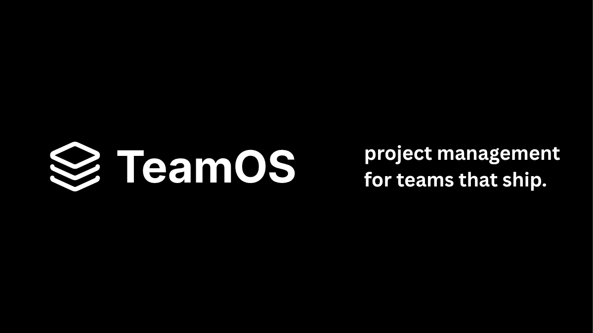
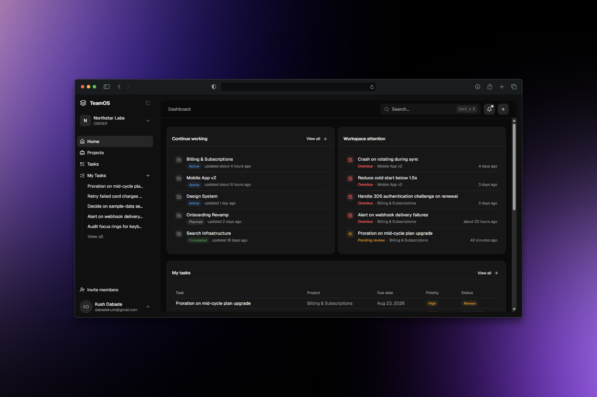
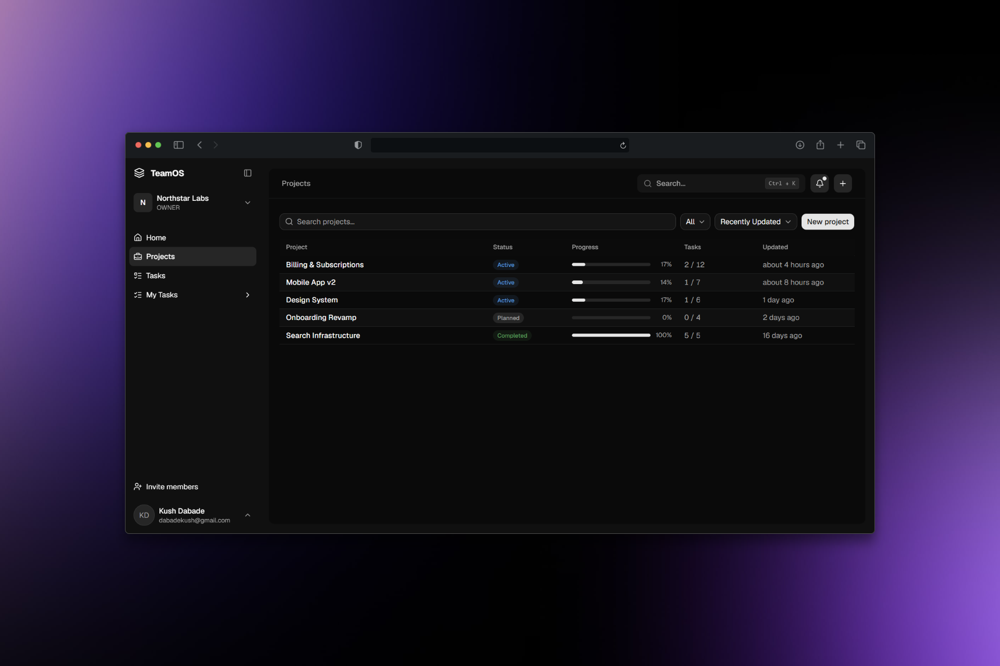
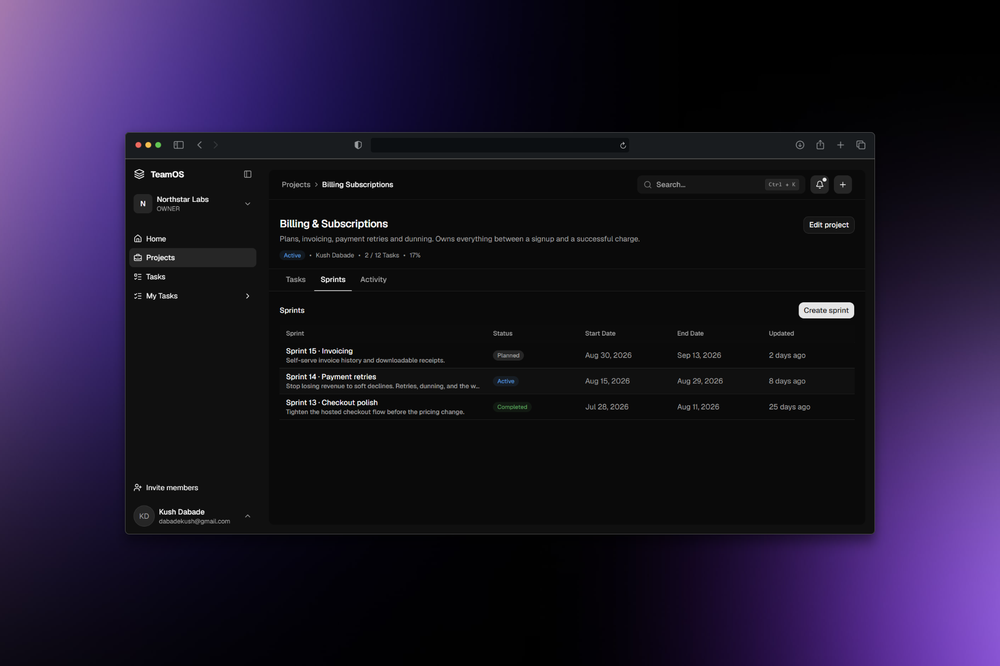
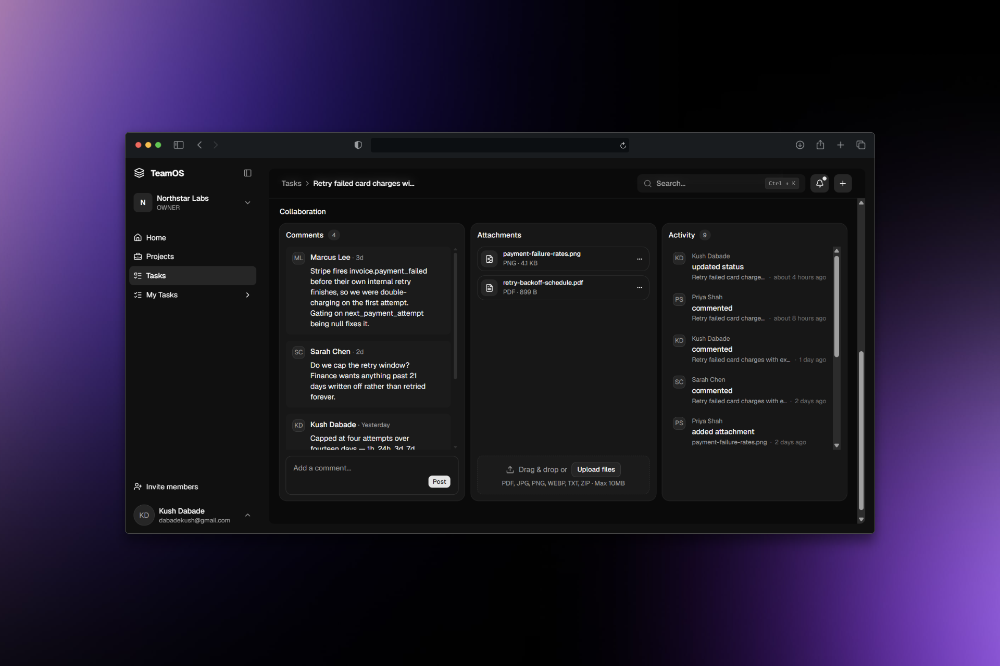
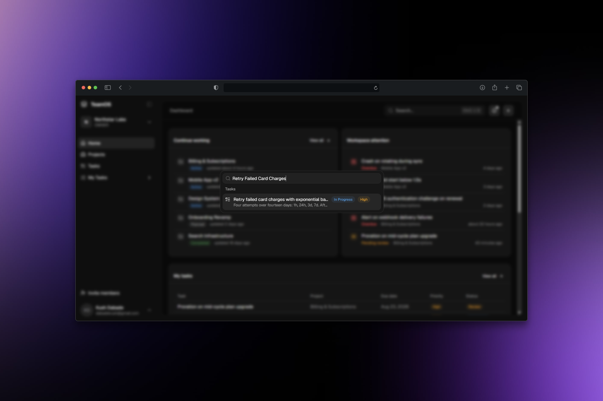
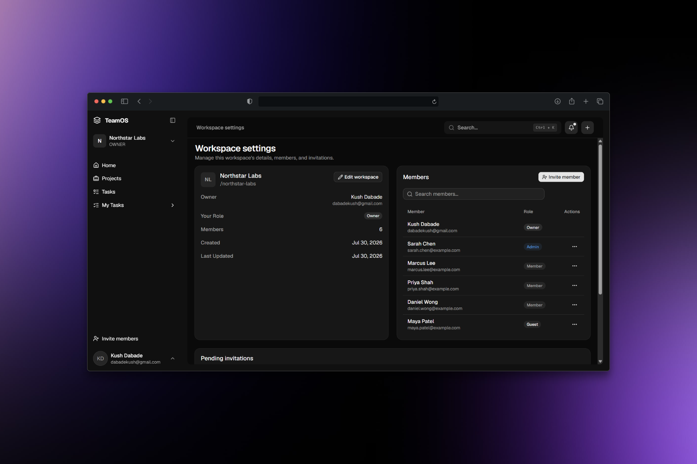
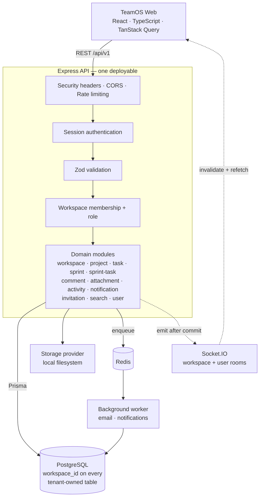

<div align="center">
  
</div>

<br />

<p align="center">
  Every team gets a workspace.<br />
  Every project, sprint, task and conversation lives inside it.
</p>

<p align="center">
  
  
  
  
  
  <a href="https://github.com/kush-dabade/TeamOS/actions/workflows/backend-ci.yml"></a>
</p>

<p align="center">
  <a href="#under-the-hood">Under the hood</a>
  ·
  <a href="#architecture">Architecture</a>
  ·
  <a href="#engineering-decisions">Engineering decisions</a>
  ·
  <a href="#security">Security</a>
  ·
  <a href="#getting-started">Getting started</a>
</p>

<br />

<div align="center">
  
</div>

<br />

## Plan the work

Projects hold the work. Every task inside them carries an owner, a priority, a due date, and a status that moves from To do, through In progress and Review, to Done. Open a project and you get its tasks, its sprints, and its history in one place instead of three.

<div align="center">
  
</div>

<br />

## Run the sprint

Scope a sprint, pull tasks into it, start it, close it. A project runs exactly one sprint at a time — enforced in the database, not by convention — so "what are we working on right now" always has a single answer.

<div align="center">
  
</div>

<br />

## Keep the context where the work is

Comments and file attachments live on the task itself. Every status change, comment and upload is written to an activity trail you can read back for a single task, a whole project, or the entire workspace. The reason a decision was made stays next to the thing it was made about.

<div align="center">
  
</div>

<br />

## No refresh required

When a teammate moves a task, starts a sprint, or leaves a comment, everyone else's screen already knows. Assignments and comments can trigger notifications. And <kbd>⌘</kbd><kbd>K</kbd> finds any project or task in the workspace from anywhere in the app.

<div align="center">
  
</div>

<br />

## Everything starts with a workspace

A workspace is one team's world — its projects, its sprints, its people, its history. You invite someone in, you give them a role, and that role is the edge of what they can see and change. Nothing leaks between teams, because nothing is ever fetched without knowing whose workspace it belongs to.

<div align="center">
  
</div>

<br />

---

<br />

## Under the hood

Six ideas that decided most of the code.

### Tenancy is checked, never trusted

Every tenant-owned table carries a `workspaceId`. Every workspace-scoped request re-resolves the caller's real membership row and role from the database before any business logic runs. A workspace id in a URL is a claim, not a credential.

### A modular monolith with clear domain boundaries

Workspace, project, task, sprint, sprint-task, comment, attachment, activity, notification, invitation, search, user — each one a module with the same shape: `routes → controller → service → schema`. Business rules live in the service; the controller does nothing but parse input and set a status code. The boundaries are real. The network hops between them aren't.

### The database commits first, realtime follows

Writes run inside a Prisma transaction, and the realtime emit is deferred until after that transaction resolves — never fired from inside the callback. No client is ever told about a change that could still roll back.

### Realtime invalidates, it never patches

A socket event is a signal, not a source of truth. The client uses it to invalidate the affected TanStack Query keys and refetch, so a dropped, duplicated or out-of-order event can't leave the UI holding state the server never had.

### Slow work leaves the request path

Email and notification fan-out go onto Redis-backed BullMQ queues with deterministic job IDs, exponential backoff, and bounded retention for failures. A retry can't send the same notification twice, and a slow email provider can't slow down a mutation.

### Some invariants belong in Postgres

"At most one active sprint per project" is a partial unique index, not a service-level check — because two concurrent requests can both pass a check, and only one of them can win a unique index.

<br />

## Architecture



Two processes built from the same Dockerfile share one database: the API serves requests, the worker drains the queues. Everything a request touches on its way in — headers, origin, rate limit, session, schema, membership, role — happens before a module can see it.

<br />

## Engineering decisions

**Why a modular monolith instead of services?**
Splitting into services buys independent deployability and charges for it in network calls, distributed transactions, and service discovery. What TeamOS actually needs is a *code* boundary, not a network boundary — so modules get enforced structure inside one process, and a future split has clean seams to cut along instead of a rewrite.

**Why one database for every tenant?**
Database-per-tenant gives isolation the application physically cannot violate, at the cost of migrating and operating N databases. A `workspaceId` column on every tenant-owned table is dramatically cheaper to build and run. The honest tradeoff is that isolation now lives in application code — which is exactly why cross-workspace access has its own regression suite instead of relying on careful review.

**Why Redis and BullMQ on a project this size?**
Sending an email is a call to somebody else's server. Left on the request path, their bad day becomes a failed mutation. On a queue, it becomes retries with backoff. Deterministic job IDs then make the retry safe: the same event can be enqueued twice and still send once.

**Why commit before emitting realtime events?**
A client that hears about a change before it's durable can render state that never existed. Emitting only after the transaction resolves means the worst case is a client that finds out slightly late — not one that finds out about a write that got rolled back.

**Why re-check tenant access on every request?**
A workspace id in a URL is something the client typed, not something the server proved. Every workspace-scoped request reads the caller's real membership and role out of the database before business logic runs, and no authorization decision is ever derived from the request body.

**Why local file storage instead of S3?**
Uploads go through a four-method interface — `upload`, `delete`, `stream`, `exists` — and the only implementation today writes to the local filesystem, because nothing is deployed to a cloud yet. Moving to S3 means writing one class behind that interface. It doesn't mean touching a single module that stores a file.

<br />

## Security

**Every protected route resolves a session.** Better Auth handles authentication with session cookies; `requireAuth` runs ahead of every tenant-scoped handler, and the Socket.IO handshake performs the same session check before a socket is allowed to connect.

**Membership and role, per request.** `OWNER`, `ADMIN`, `MEMBER` and `GUEST` are re-read from the database on every workspace-scoped request and enforced in the service layer, before any side effect. Personal resources like notifications authorize on ownership of the row instead.

**Validation at the boundary.** Zod parses every request body and query string in the controller. One central error handler maps Zod, Prisma, storage, auth and upload failures onto a consistent JSON error shape, so no internals leak out through an unhandled throw.

**Uploads are bounded and checked.** Attachments are capped at 10 MB and the declared MIME type must match an explicit allowlist. Every storage key is resolved and confirmed to land inside the upload root before a write, and download filenames are escaped so a crafted name can't inject a response header.

**Rate limiting that survives more than one instance.** Redis-backed limiters cover sign-in, sign-up, verification email, password reset, search, uploads, invitations, and the general API surface — with an explicitly configured trusted-proxy hop count, so the client IP can't be spoofed through a forwarded header.

**Hardened responses.** `nosniff`, `X-Frame-Options: DENY`, `Referrer-Policy`, a `default-src 'none'` CSP sized for a JSON-only API, and HSTS in production. `X-Powered-By` is off.

**Revoking access revokes the socket.** Removing a member from a workspace evicts their live sockets from that workspace's room immediately, instead of leaving an open connection receiving broadcasts until it happens to reconnect.

**Proven, not asserted.** The backend suite runs against a real Postgres and Redis in CI on every pull request, with dedicated coverage for cross-workspace isolation, RBAC, unauthenticated access, email verification and password reset, rate limiting, security headers, transactional writes, queue idempotency, realtime room isolation, and graceful shutdown.

<br />

## Tech stack

|  |  |
|---|---|
| **Frontend** | React · TypeScript · Vite · Tailwind CSS · shadcn/ui · TanStack Query |
| **Backend** | Node.js · Express · TypeScript · Prisma |
| **Data** | PostgreSQL · Redis |
| **Async** | BullMQ |
| **Realtime** | Socket.IO |
| **Auth & validation** | Better Auth · Zod |
| **Storage** | Local filesystem provider behind a four-method interface |
| **Infrastructure** | Docker · GitHub Actions |

<br />

## Getting started

Requires Docker and Docker Compose, plus Node.js locally (for the frontend, and for seeding local demo data).

### 1. Clone and configure environment

```bash
git clone https://github.com/kush-dabade/TeamOS.git
cd TeamOS

cp .env.example .env                  # Postgres + Redis credentials for Compose
cp backend/.env.example backend/.env  # application config for the API and worker
```

Both files already ship with working local-development values (Postgres/Redis credentials, `localhost` URLs) — local-only placeholders, never production credentials.

One value has no safe default and won't work left blank: `BETTER_AUTH_SECRET` in `backend/.env`, the signing secret for session tokens. Generate one and paste it in:

```bash
openssl rand -base64 32
```

`RESEND_API_KEY`/`EMAIL_FROM` can stay blank for now — see [Email verification](#email-verification) below.

### 2. Start Docker

```bash
docker compose up --build
```

Builds the backend image, starts Postgres and Redis, applies pending migrations, then brings up the API on port `3000` and the background worker. (The backend image defaults to production behavior; Compose runs the local API/worker services in development mode instead, which is what makes the example values above the right ones to use here.)

Leaving `RESEND_API_KEY`/`EMAIL_FROM` blank means the `worker` service will fail to start — visible as repeated restarts in `docker compose logs worker`. That's expected for now (see [Email verification](#email-verification)) and doesn't block the rest of this setup.

### 3. Seed local demo data

```bash
cd backend
npm install
npm run seed
```

Creates a deterministic demo workspace — projects, tasks across every status, an active sprint, a couple of comments — so there's something to explore immediately instead of an empty account. Safe to run more than once: it's idempotent, and refuses to run outside local development.

Sign in with:

```text
demo@teamos.local / TeamOSDemo123!
```

A local-only demo account with a publicly-documented password — never reuse it, and never point this seed at anything but a local database.

### 4. Start the frontend

The frontend runs outside Compose:

```bash
cd frontend
cp .env.example .env
npm install
npm run dev
```

Sign in with the demo account above, or register your own — see [Email verification](#email-verification) for why that doesn't require a Resend account locally.

<br />

### Email verification

Local development automatically verifies new accounts on sign-up and skips sending the verification email, so signing up and signing in work immediately without a Resend account. This is a local-development convenience, not a security feature — production always runs the real email-verification flow, and this repository's own test suite exercises that real flow too.

`RESEND_API_KEY`/`EMAIL_FROM` are still what workspace invitations and password resets send through. Those stay unset by default and need a real Resend account before that mail can actually be delivered locally.

<br />

### Running tests

```bash
cd backend
cp .env.test.example .env.test
docker compose exec postgres createdb -U postgres teamos_test   # one-time
npm test
```

`.env.test.example` already includes the (dummy) email configuration the test suite itself needs — no Resend account required for tests either.

<br />

## Roadmap

The product loop is built and working end to end: workspaces, membership and roles, invitations, projects, tasks, sprints, comments, attachments, activity, notifications, search, and realtime — behind a CI pipeline that gates every pull request on lint, typecheck, and the full backend suite.

From here it's built in focused phases.

**Now** — production-readiness hardening.

**Next** — the remaining product capabilities, broader automated testing, and continued infrastructure work.

**Finally** — deployment, documentation, and polish.

TeamOS is under active development. It isn't finished, and it doesn't pretend to be.

<br />

---

<div align="center">

Built by [Kush Dabade](https://github.com/kush-dabade)

</div>
