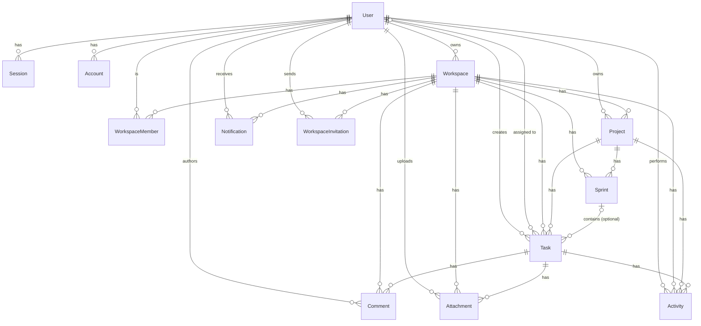

# TeamOS — Database Design

Written directly from `backend/prisma/schema.prisma` and `backend/prisma/migrations/`. If this document and the schema ever disagree, the schema is correct — treat that as a bug in this doc, not in the code.

## 1. Database Overview

- **Engine**: PostgreSQL (`datasource db { provider = "postgresql" }`).
- **ORM**: Prisma, generated client output at `backend/src/generated/prisma`.
- **ID strategy**: every application model uses `id String @id @default(cuid())` — **cuid, not UUID**. Better Auth's own tables (`User`, `Session`, `Account`, `Verification`) use plain `String @id` with Better Auth generating the id itself, following the same string-id convention rather than a numeric key.
- **Migration strategy**: versioned Prisma migrations under `backend/prisma/migrations/`, one directory per migration, applied via `prisma migrate deploy` (run by the `migrate` one-off service in `docker-compose.yml` before `backend`/`worker` start). One invariant (see [§6](#6-constraints-and-invariants)) is hand-authored SQL because Prisma's schema DSL cannot express it.

## 2. Entity Model



`Team` does not exist as a model anywhere in the schema — there is no Teams table. Better Auth's `Session`/`Account`/`Verification` tables are omitted from the lower half of the diagram for readability; they relate only to `User`, shown above.

## 3. Core Models

**`User`** (`@@map("user")`) — one row per account, including demo accounts. `email` is globally unique. `isDemo`/`demoExpiresAt` mark and time-bound a public-demo account (see `docs/features/demo.md`); both are `null`/`false` for every real user and are never client-writable (enforced in Better Auth config, not the schema itself).

**`Session`, `Account`, `Verification`** — Better Auth's own tables (session tokens, OAuth/credential accounts, email-verification/password-reset tokens). Not hand-modeled application data; documented here only because they live in the same schema and database.

**`Workspace`** — the tenant boundary. `slug` is globally unique (not scoped per-owner); `ownerId` names one accountable `User`. Every other application-domain tenant-owned resource below carries its own `workspaceId`.

**`WorkspaceMember`** — the join between `User` and `Workspace`, carrying exactly one `role` (`OWNER`/`ADMIN`/`MEMBER`/`GUEST`). Unique on `(workspaceId, userId)` — a user can only have one membership row per workspace.

**`Project`** — belongs to one `Workspace` and has one `ownerId`. `slug` is unique **per workspace** (`@@unique([workspaceId, slug])`), not globally. `status` is `PLANNED | ACTIVE | COMPLETED | ARCHIVED`.

**`Task`** — belongs to one `Workspace` and one `Project`; optionally belongs to one `Sprint` (`sprintId`, nullable) and one assignee (`assigneeId`, nullable). `createdById` is required and restricted (a user who created tasks cannot be hard-deleted while they exist — see [§6](#6-constraints-and-invariants)). Soft-deleted via `deletedAt` rather than removed. `status` is `TODO | IN_PROGRESS | REVIEW | DONE`; `priority` is `LOW | MEDIUM | HIGH | URGENT`.

**`Sprint`** — belongs to one `Workspace` and one `Project`. `status` is `PLANNED | ACTIVE | COMPLETED`. `name` is unique per project (`@@unique([projectId, name])`). There is **no `SprintTask` join-table model** — a task's sprint membership is the direct `Task.sprintId` foreign key; the `sprint-task` backend module manages that field, it does not manage a separate table.

**`Comment`** — belongs to one `Workspace` and one `Task`, authored by one `User`. Soft-deleted via `deletedAt`.

**`Attachment`** — belongs to one `Workspace` and one `Task`, uploaded by one `User`. `storageKey` is globally unique and is the only field the storage layer uses to locate the file — it is never client-supplied (see `docs/features/attachments.md`).

**`Activity`** — an append-only log row per significant domain event (`ActivityType`, e.g. `TASK_STATUS_CHANGED`, `MEMBER_REMOVED`, `SPRINT_STARTED`). Belongs to one `Workspace`, has one `actorId`, and optionally references the `Task`/`Project` it concerns (`taskId`/`projectId`, both nullable and `onDelete: SetNull` — an activity row outlives the entity it described).

**`Notification`** — belongs to one `Workspace`, addressed to one `recipientId`. `type` is a fixed `NotificationType` enum (invitation received, task assigned, comment on an assigned task, mentioned in a comment, ownership transferred). Soft-deleted via `deletedAt`; read state tracked via `isRead`/`readAt`.

**`WorkspaceInvitation`** — belongs to one `Workspace`, targets an `email` (not necessarily an existing `User`), carries the `role` the invitee will receive, a unique `token`, an `expiresAt`, and a `status` (`PENDING | ACCEPTED | DECLINED | EXPIRED`).

## 4. Tenant Isolation

Every application-domain tenant-owned resource above (`Project`, `Task`, `Comment`, `Attachment`, `Activity`, `Sprint`, `Notification`, `WorkspaceInvitation`) has its **own** `workspaceId` column and its own foreign key to `Workspace` — none of them require a join through a parent to know which tenant they belong to. This is what lets every service query filter directly on `workspaceId` (see `system-design.md`, [§7](../architecture/system-design.md#7-multi-tenancy)).

The database schema **supports** tenant isolation by making `workspaceId` present and indexed everywhere it's needed; it does not **enforce** it. There is no PostgreSQL Row-Level Security policy, and nothing at the schema level stops a query from omitting a `workspaceId` filter — that guarantee is entirely the application's responsibility (`requireWorkspaceMembership` in every relevant service function). A future query that forgets to scope by `workspaceId` would be a real bug the database would not catch.

## 5. Relationships

```text
Workspace
 ├── WorkspaceMember  (role: OWNER | ADMIN | MEMBER | GUEST)
 ├── Project
 │    ├── Task
 │    │    ├── Comment
 │    │    ├── Attachment
 │    │    └── Activity (via taskId)
 │    ├── Sprint
 │    │    └── Task (optional, via Task.sprintId)
 │    └── Activity (via projectId)
 ├── Activity          (workspace-level, always present)
 ├── Notification
 └── WorkspaceInvitation
```

A `Task` carries three independent foreign keys: `workspaceId` (direct), `projectId` (direct, references `Project`), and an optional `sprintId` (direct, references `Sprint` — not resolved through `Project`). There is no composite foreign key or database constraint requiring that a task's `workspaceId`/`projectId`/`sprintId` actually form a consistent hierarchy (i.e. that the referenced `Sprint` belongs to the same `Project`, which belongs to the same `Workspace`) — the schema would allow assigning a task to a sprint from a different project if nothing else stopped it. That consistency is an application-maintained invariant: the `sprint-task` module's assignment logic is what keeps a task's sprint, project, and workspace aligned when a task is added to a sprint, not a database-level guarantee.

## 6. Constraints and Invariants

**Database-enforced:**
- `User.email`, `Workspace.slug`, `Attachment.storageKey`, `WorkspaceInvitation.token`, `Session.token`, `Account.(providerId, accountId)` — unique.
- `WorkspaceMember.(workspaceId, userId)` — unique (one membership per user per workspace).
- `Project.(workspaceId, slug)` — unique per workspace, not globally.
- `Sprint.(projectId, name)` — unique per project.
- **One active sprint per project**: enforced by a **hand-authored partial unique index**, `Sprint_projectId_active_unique` on `Sprint(projectId) WHERE status = 'ACTIVE'` (migration `20260819130000_add_sprint_active_partial_unique_index`, built `CONCURRENTLY` to avoid locking the table). This is *not* expressible in Prisma's schema DSL (`@@unique` has no `WHERE` clause), which is why it doesn't appear as a native `@@unique` in `schema.prisma` and won't show up via `prisma db pull`/`migrate diff` — it exists only in the migration SQL and is documented directly on the `Sprint` model as a comment. It exists specifically to close a TOCTOU race that an application-level "is there already an active sprint?" check alone cannot: two concurrent `startSprint` calls can both pass that check before either commits; only a database constraint can guarantee the loser gets a real conflict instead of a second "active" row.
- **Foreign keys and cascade behavior** (see each model's `onDelete`): deleting a `Workspace` cascades to every application-domain tenant-owned resource (`WorkspaceMember`, `Project`, `Task`, `Comment`, `Attachment`, `Activity`, `Sprint`, `Notification`, `WorkspaceInvitation`) — a workspace's data doesn't outlive the workspace. Deleting a `Project` cascades to its `Task`s and `Sprint`s; deleting a `Task` cascades to its `Comment`s and `Attachment`s. A `Task`'s `sprintId` is `onDelete: SetNull` (deleting a sprint un-assigns its tasks rather than deleting them); its `assigneeId` is likewise `SetNull` (removing/deleting an assignee doesn't delete the task). `Activity.taskId` and `Activity.projectId` are also `SetNull` — an activity record outlives the entity it referenced, rather than cascading away with it. By contrast, `createdById` on `Task`, `authorId` on `Comment`, `uploadedById` on `Attachment`, `actorId` on `Activity`, and `ownerId` on `Project` are all `onDelete: Restrict` — the database refuses to delete a `User` who has created content, preserving the historical record rather than silently orphaning or cascading it away.

**Application-enforced (not database-enforced):**
- **At most one pending `WorkspaceInvitation` per `(workspaceId, email)`** — checked in `invitation.service.ts` before inserting; unlike the sprint invariant above, there is no matching partial unique index backing it, so this is not database-enforced. Low practical impact (a duplicate invitation email at worst).
- **Workspace slug generation** — the `slug` column's `@unique` constraint guarantees no two workspaces ever end up with the same slug, but *picking* a free slug is a check-then-insert loop; the database constraint is the final guard against a lost race, not a prevention of the race itself.
- Role/ownership authorization (who may change a role, transfer ownership, archive a project) — entirely in the service layer, not expressible as a schema constraint.

Both the invitation and slug cases are ordinary application-level races, not equivalent to the sprint invariant's database-level guarantee above.

## 7. Indexing

Indexes are chosen for the query patterns the services actually run, not by convention:

- **Tenant-scoped listing**: `@@index([workspaceId])` on every application-domain tenant-owned resource — the base filter for "everything in this workspace."
- **Composite pagination indexes**, added incrementally as real list endpoints needed them (see the migration names): `Task(workspaceId, status)`, `Task(workspaceId, assigneeId)`, `Task(projectId, deletedAt, createdAt, id)`, `Task(workspaceId, deletedAt, createdAt, id)` — the trailing `(createdAt, id)` pair supports deterministic ordering for paginated task queries (the API's task pagination itself is offset-based, `page`/`limit` — see `api-specification.md` §6 — this index supports that query/order pattern, it does not make the endpoint keyset-paginated). Equivalent composite indexes exist for `Comment(taskId, createdAt, id)`, `Notification(recipientId, createdAt DESC, id DESC)`, and `Activity(workspaceId, createdAt DESC, id DESC)` (plus task/project-scoped variants of the activity index).
- **Membership lookups**: `WorkspaceMember(workspaceId)`, `WorkspaceMember(userId)`, and `WorkspaceMember(workspaceId, role)` — the last supports "who are the admins/owners of this workspace" without scanning every member.
- **Search**: dedicated search-supporting indexes were added in the `add-search-indexes` and `add-sprint-search-index` migrations (the latter concurrently created/recreated, per the migration names, to avoid a long lock on `Sprint`).
- **Invitations**: `WorkspaceInvitation(email)`, `(status)`, `(workspaceId, status)` — supports both "invitations sent to me" and "pending invitations for this workspace."
- **Demo cleanup**: `User(isDemo, demoExpiresAt)` — a plain composite index (not a partial one), sized deliberately: the demo-cleanup worker's sweep query (`WHERE isDemo = true AND demoExpiresAt <= now()`) doesn't need a partial index's extra precision at this application's scale, per the schema's own comment on the index.

This is not an exhaustive index dump — see `schema.prisma` directly for the complete, current list on any given model.

## 8. Migration Strategy

Development: `prisma migrate dev` generates and applies migrations against the local database. Deployment (including Docker Compose): the `migrate` service runs `prisma migrate deploy` once, before `backend`/`worker` start (`docker-compose.yml`'s `depends_on` ordering) — deploy-mode migrate only applies already-generated migrations, it never generates new ones against a running environment. The one hand-authored migration (the sprint partial unique index) documents its own recovery procedure directly in its SQL file for the specific failure mode `CREATE INDEX CONCURRENTLY` has (an interrupted build can leave an invalid index that must be dropped and the migration re-run) — that is the only migration in the set requiring manual awareness beyond the normal `migrate deploy` path.

## 9. Data Integrity Considerations

- **Foreign keys** are the primary integrity mechanism (see cascade/restrict behavior in [§6](#6-constraints-and-invariants)) — there is no orphaned-row cleanup job; the schema itself prevents most orphaning by design (`Restrict` on content-creator relations, `SetNull`/`Cascade` elsewhere as appropriate).
- **Transactions**: used where multiple writes must succeed or fail together — most visibly the sprint-start/ownership-transfer paths, which take an explicit row lock (`SELECT ... FOR UPDATE` via `lockWorkspaceMembership`, `shared/authorization/workspace-access.ts`) as the first statement inside a `$transaction`, so two concurrent requests serialize on that lock rather than racing.
- **Concurrency-sensitive operations** given a real, verified mechanism rather than a best-effort check: the one-active-sprint invariant (database partial unique index) and membership/ownership transfer (explicit row locking, above). The workspace-slug and pending-invitation checks are not — see [§6](#6-constraints-and-invariants).
- **Soft deletes** (`Task.deletedAt`, `Comment.deletedAt`, `Notification.deletedAt`) preserve history and referential integrity for anything that references them, at the cost of every read query needing to remember to filter `deletedAt: null` — a real, if ordinary, maintenance burden rather than a database-enforced guarantee.
