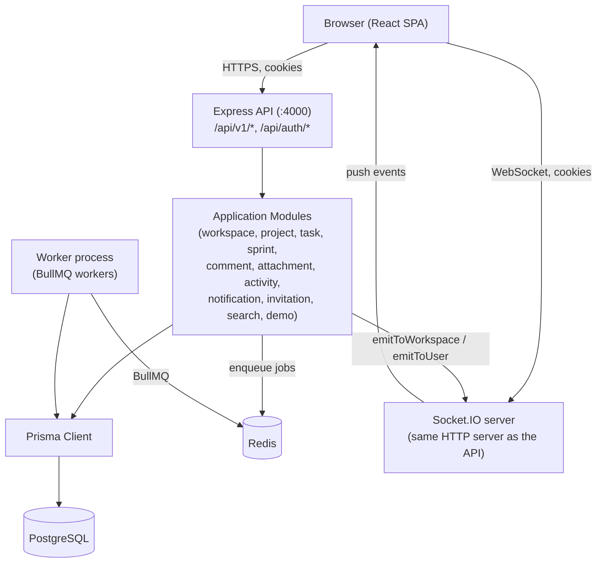
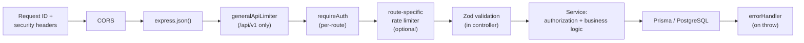
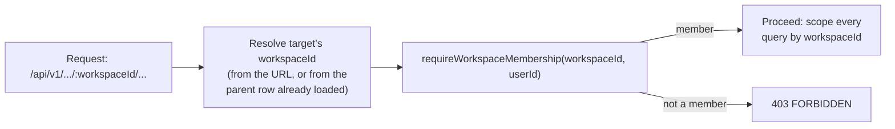
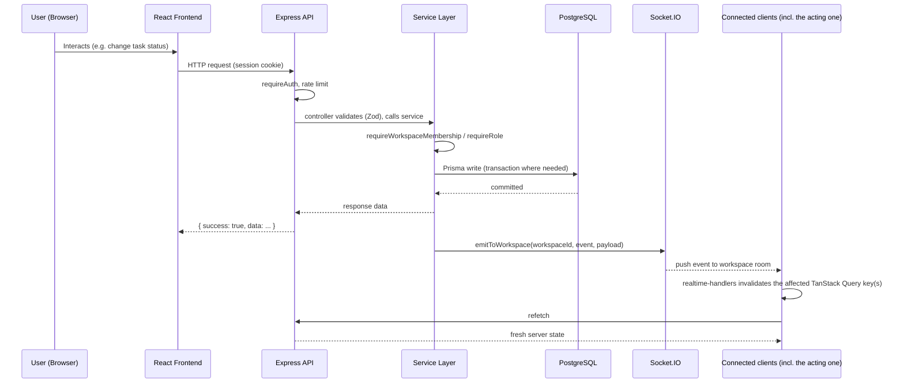

# TeamOS — System Design

## 1. Overview

TeamOS is a multi-tenant SaaS project management platform (workspaces, projects, tasks, sprints, comments, attachments, activity, notifications, realtime collaboration, and a public demo). It is built as a **modular monolith**: one Express/TypeScript backend, one React/TypeScript frontend, one PostgreSQL database, with Redis/BullMQ for background work and Socket.IO for realtime updates.

The architecture fits the project's actual requirements: a single team's product-management tool with clear feature boundaries (workspaces → projects → tasks → sprints/comments/attachments), moderate traffic, and a shared-database multi-tenancy model. There is no requirement here that a distributed system would address — TeamOS has one modular-monolith application codebase, and the HTTP/Socket.IO API keeps transactions, authorization, and realtime emission all in the same process, which is what makes the "commit, then notify" pattern in [§10](#10-realtime-architecture) simple to reason about. The BullMQ worker runs as a separate *process* from that same codebase ([§11](#11-background-jobs)) — a deployment detail, not a departure from the modular monolith itself.

## 2. Architecture at a Glance



The API server and the Socket.IO server are the **same process** (`backend/src/server.ts` attaches Socket.IO to the same `http.Server` Express listens on — see `initializeRealtime(server)`). The BullMQ workers run as a **separate process** (`backend/src/worker.ts`, the `worker` service in `docker-compose.yml`), sharing the same Postgres database and Redis instance.

## 3. Architectural Style

TeamOS has one modular-monolith application codebase — not a set of independently deployed services. The HTTP/Socket.IO API and the BullMQ worker run as separate *processes* from that one codebase (see [§2](#2-architecture-at-a-glance) and [§11](#11-background-jobs)); that is a deployment/runtime detail, not a microservice split — both processes import the same modules, share the same Prisma client and database, and are built from the same source tree and (per `docker-compose.yml`) the same backend image. Within that codebase, modules are separated **by directory and by convention**, not by hard package/process boundaries: every module under `backend/src/modules/<name>/` follows the same internal shape —

```
<module>/
├── <module>.routes.ts       # Express Router, wires middleware + controller
├── <module>.controller.ts   # parses request, calls the service, shapes the response
├── <module>.service.ts      # business logic, Prisma calls, authorization checks
├── <module>.schema.ts       # Zod request validation
└── <module>.types.ts        # shared TypeScript types for the module
```

- **Routes** attach `requireAuth` (and any rate limiter) and do nothing else.
- **Controllers** parse/validate input (via the module's Zod schema) and translate the service's return value into the `{ success, data }` response envelope. They contain no business logic.
- **Services** hold the actual business logic: authorization checks (`requireWorkspaceMembership`, `requireRole` from `shared/authorization/workspace-access.ts`), Prisma queries/transactions, activity logging, notification enqueueing, and realtime emission.
- **Dependency direction** is one-way: controllers depend on services, services depend on Prisma/shared utilities — services never import from controllers, and modules call each other's *services* directly (e.g. `demo.service.ts` calls `workspace.service.ts`'s `createWorkspace`) rather than going back through HTTP.

This is a genuine convention, not an enforced boundary: nothing prevents one module's service from importing another's internals, and several modules already call each other directly at the service layer. This is intentional for a project this size — microservices, or even strict internal package boundaries, would add real operational cost (independent deploys, network calls between what are today in-process function calls, distributed transactions) with no corresponding benefit, since there is one team, one deploy, and one database. See [§17](#17-important-architectural-tradeoffs).

## 4. Request Lifecycle

A typical authenticated `/api/v1/*` request passes through, in this order (see `backend/src/app.ts`):



- **Request ID + security headers** (`middleware/request-id.ts`, `middleware/security-headers.ts`) are mounted first, before CORS or body parsing, so every response — including early failures — carries them.
- `/api/auth/*` (Better Auth) is mounted as its own catch-all (`app.all("/api/auth/*splat", toNodeHandler(auth))`) with its own targeted rate limiters on the sign-in/sign-up/verification/password-reset paths, ahead of the generic JSON body parser.
- **Authentication** happens per-route via the `requireAuth` middleware (`middleware/require-auth.ts`), which calls `auth.api.getSession(...)` and attaches `req.user`. There is no single global "everything under /api/v1 requires auth" gate — each route file applies `requireAuth` explicitly (the public exceptions are `POST /api/v1/demo/session` and `GET /api/v1/invitations/token/:token`).
- **Validation** happens inside each controller, via that module's Zod schema (`schema.parse(req.body)` / `schema.parse(req.query)`).
- **Authorization** happens inside the service layer: `requireWorkspaceMembership(workspaceId, userId)` and `requireRole(membership, roles)` from `shared/authorization/workspace-access.ts` are called explicitly wherever a resource needs tenant/role checks — not via a generic middleware, since the resource (and the workspace it belongs to) differs per module.
- **Errors** thrown anywhere in this chain (a typed error class, a `ZodError`, a Prisma error, a Multer error, a Better Auth `APIError`, or a malformed/oversized body from `express.json()`) are all normalized by the single `errorHandler` (`middleware/error-handler.ts`) into one JSON error shape — see [§14](#14-error-handling-and-validation).

## 5. Authentication

TeamOS uses **Better Auth** (`backend/src/lib/auth.ts`) with **session cookies** — there is no JWT/Bearer token anywhere in the request path. `requireAuth` and the Socket.IO handshake both authenticate by calling `auth.api.getSession({ headers })`, which resolves the request's session cookie against the `session` table.

Key points, verified against `backend/src/lib/auth.ts`:
- Sessions last 7 days (`SESSION_EXPIRES_IN_SECONDS`), with a rolling refresh once a session is more than 1 day old (`SESSION_UPDATE_AGE_SECONDS`) — both explicit, reviewed values, not implicit library defaults.
- Cookies are marked `Secure` based on `isProduction`, not inferred from the configured base URL, so a misconfigured production URL can't silently ship an insecure cookie.
- `emailAndPassword.requireEmailVerification: true` — an unverified account cannot sign in and cannot accept a workspace invitation, since invitation eligibility is checked against the session's own (verified) email.
- **Local-development-only bypass**: a `databaseHooks.user.create.before` hook marks every new user `emailVerified: true` at creation time, but only when `isLocalDevelopment` is true (`NODE_ENV === "development"` exactly — not `test`, not an unset `NODE_ENV`). This exists purely so a fresh clone can be exercised without a working Resend account; it cannot activate in production or in the test suite (`tests/security/email-verification.test.ts` exercises the real, non-bypassed flow).
- Explicit session revocation (sign-out, password reset) triggers a `databaseHooks.session.delete.after` hook that evicts the user's live Socket.IO connections — see [§10](#10-realtime-architecture).
- `User.image` cannot be set through Better Auth's generic `update-user` or `sign-up/email` endpoints (`AVATAR_IMAGE_PROTECTED_PATHS`, enforced in a `hooks.before` check) — avatar changes must go through the dedicated upload/delete endpoints in the `user` module, which always derive the storage key server-side. This closes a cross-user avatar IDOR that the generic endpoints would otherwise allow.
- Two demo-specific fields (`isDemo`, `demoExpiresAt`) are exposed on the session/user object as read-only (`input: false`) additional fields — a client can read them but can never set them; only `demo.service.ts`'s direct Prisma write can.

## 6. Authorization and RBAC

**Authentication** answers "who is this?" (a valid session). **Authorization** answers "is this user allowed to do this, on this resource, in this workspace?" — a separate check, made per-request, inside the relevant service function.

- Every workspace has members, each with exactly one `WorkspaceRole`: `OWNER`, `ADMIN`, `MEMBER`, or `GUEST` (`WorkspaceMember.role`, `WorkspaceRole` enum).
- `requireWorkspaceMembership(workspaceId, userId)` looks up the caller's `WorkspaceMember` row and throws a `ForbiddenError` if none exists — this is the base check almost every workspace-scoped service function makes before doing anything else.
- `requireRole(membership, roles)` additionally checks the membership's role against an allow-list for actions that aren't open to every member (e.g. removing another member, changing roles, deleting a project).
- **Ownership** is a distinct concept from role: `Workspace.ownerId` and `Project.ownerId` identify a single accountable user, checked directly in the services that need it (e.g. only the workspace owner can transfer ownership; only a project's owner or a workspace `OWNER`/`ADMIN` can archive it — see `project.service.ts`).
- All of this enforcement is **server-side only**, inside the service layer — there is no database-level row-security or client-trusted role claim. See [§7](#7-multi-tenancy) for why the workspace identity itself is never trusted from the client either.

## 7. Multi-Tenancy

TeamOS uses a **shared PostgreSQL database** (all workspaces' data lives in the same tables), with **`workspaceId`** as the tenant boundary — not a database-per-tenant model, and not PostgreSQL Row-Level Security. Isolation is enforced entirely in the application layer:

1. Every application-domain tenant-owned resource (`Project`, `Task`, `Comment`, `Attachment`, `Activity`, `Sprint`, `Notification`, `WorkspaceInvitation` — not Better Auth's own `User`/`Session`/`Account`/`Verification` tables) carries its own `workspaceId` foreign key directly — not derived transitively through a parent (e.g. `Task.workspaceId` is a real column, not looked up via `Task.project.workspaceId`), so every tenant-scoped query can filter on it directly without a join.
2. The workspace a request acts on always comes from the **URL path** (`:workspaceId`, or transitively `:projectId`/`:taskId`/etc., which the service resolves back to a `workspaceId` via Prisma before doing anything else) — never from a client-supplied body field or header. A client cannot claim a different workspace identity than the resource it's addressing actually belongs to.
3. Workspace-scoped service operations enforce membership — via `requireWorkspaceMembership(workspaceId, userId)` (`shared/authorization/workspace-access.ts`) — before allowing the operation to proceed. A user who is authenticated but not a member of the target workspace gets a `403 FORBIDDEN`, not a `404` (the resource's existence isn't hidden, only access to it is denied) — this pattern was verified directly in the attachment, comment, task, project, and sprint services reviewed while writing this document, not mechanically proven across every service function in the codebase.
4. Cross-workspace access is additionally impossible *by construction* in most read paths: a lookup like "get task by id" first loads the task, reads its `workspaceId`, and only then checks membership against that value — a request for a task in a workspace the caller isn't a member of fails the membership check regardless of which task id was guessed.



This is application-enforced tenant isolation, not database-enforced — PostgreSQL itself would allow a query without a `workspaceId` filter to read across tenants. The guarantee comes from every service consistently scoping its Prisma queries and checking membership first, which is why this is the single most important convention to preserve when adding new workspace-scoped resources.

## 8. Backend Module Architecture

| Module | Responsibility |
|---|---|
| `workspace` | Workspace CRUD, membership listing/role changes/removal/leave, ownership transfer. Membership is **part of this module**, not a separate one — there is no dedicated `membership` module directory. |
| `invitation` | Workspace invitations: create/list/cancel/resend (workspace-scoped), and the invitee-facing accept/decline/preview flow (by id or by token). |
| `user` | Current-user profile/avatar upload, retrieval, and deletion; other users' avatars (read-only). |
| `project` | Project CRUD, status/lifecycle (archive/restore), ownership transfer. |
| `task` | Task CRUD, listing (per-project and per-workspace), status/priority/assignment/due-date updates. |
| `sprint` | Sprint CRUD, start/complete lifecycle, the one-active-sprint-per-project invariant. |
| `sprint-task` | Assigning/removing tasks to/from a sprint and listing a sprint's tasks. There is no separate join-table model — this manages `Task.sprintId`, a direct foreign key. |
| `comments` | Task comments: create/list/update/soft-delete. |
| `attachment` | Task attachment upload, listing, download, deletion, backed by the storage abstraction ([§12](#12-storage-architecture)). |
| `activity` | Append-only workspace activity log, written by other modules' services and read via one workspace-scoped listing endpoint. |
| `notification` | Per-user notifications: list (cursor-paginated), unread count, mark-read/mark-all-read. Created both directly and via the BullMQ notification queue. |
| `search` | Cross-entity (project/task, etc.) search scoped to one workspace. |
| `demo` | Public, unauthenticated provisioning of an isolated demo tenant (`/try`) — see [§18](#18-end-to-end-architecture-flow) and `docs/features/demo.md`. |
| `email` | Resend-backed email delivery (verification, password reset, workspace invitation) and templates, invoked from the BullMQ email queue/worker. |

Each module owns its own routes/controller/service/schema; cross-module calls (e.g. `demo.service.ts` → `workspace.service.ts`, or any service → `activity.service.ts`/`realtime.emitter.ts`) go directly through the target module's exported service functions.

## 9. Database Architecture

PostgreSQL via Prisma, with `cuid()`-generated string primary keys on every application model (not UUIDs, not auto-increment integers). Better Auth's own tables (`User`, `Session`, `Account`, `Verification`) live in the same database and schema, managed by the same Prisma client. Schema changes go through versioned Prisma migrations (`backend/prisma/migrations/`); one invariant — the one-active-sprint-per-project partial unique index — is hand-authored SQL because Prisma's schema DSL has no `WHERE` clause syntax for `@@unique`.

Full model definitions, relationships, constraints, and indexes are documented in **[`database-design.md`](./database-design.md)** — this section intentionally does not duplicate that.

## 10. Realtime Architecture

TeamOS uses **Socket.IO**, attached to the same HTTP server the Express API runs on (`backend/src/realtime/realtime.server.ts`).

- **Handshake authentication**: `authenticateSocket` (`realtime.auth.ts`) calls the same `auth.api.getSession(...)` used by `requireAuth`, reading the session cookie from the socket handshake headers. A socket that fails this is rejected before `connection` ever fires.
- **Rooms are server-derived, never client-supplied**: on connect, a socket joins `user:<userId>` (`joinUserRoom`) and one `workspace:<workspaceId>` room per workspace the authenticated user is actually a member of, queried live from `WorkspaceMember` (`joinWorkspaceRooms`) — a client cannot ask to join an arbitrary room. `joinWorkspaceRooms` re-reads membership a second time after the initial join to close a narrow race against a concurrent membership change (see the function's own comment in `realtime.server.ts`).
- **Member removal**: when a `WorkspaceMember` row is deleted (`removeWorkspaceMember`/`leaveWorkspace`), `evictFromWorkspace` (`realtime.eviction.ts`) finds that user's currently-connected sockets (via their `user:<id>` room) and makes them leave the now-stale workspace room — an already-connected socket doesn't keep receiving that workspace's events just because it joined before the removal.
- **Session revocation**: sign-out/password-reset deletes the Better Auth session row, which triggers a hook that emits `session.revoked` to the affected user's sockets and disconnects them outright (not just a room leave). A second, independent check (`isSessionStillActive`) re-validates the session directly against the database during connection setup, closing a narrow handshake-vs-revocation race that authentication alone can't.
- **Tenant isolation for events**: every emit goes through `emitToWorkspace(workspaceId, event, payload)` or `emitToUser(userId, event, payload)` (`realtime.emitter.ts`), which target exactly one room via `io.to(room).emit(...)` — there is no global broadcast anywhere in the emitter. Combined with server-derived room membership above, a user in Workspace A cannot receive Workspace B's events: they are never in that room to begin with.
- **Event ordering — database-first**: every service reviewed that emits a realtime event does so as the **last step**, after its Prisma write (and any `$transaction`) has already committed — verified in `comments.service.ts`, `project.service.ts`, `task.service.ts`, `sprint.service.ts`, `sprint-task.service.ts`, `attachment.service.ts`, `activity.service.ts`, `workspace.service.ts`, and `invitation.service.ts`, plus `notification.service.ts` for its own `NOTIFICATION_READ`/`NOTIFICATION_READ_ALL` emits (see the `NOTIFICATION_CREATED` exception directly below — it does not follow this same in-process path). Realtime emission is best-effort and is not the source of truth for persistence: `emitToRoom` wraps the actual `io.to(room).emit(...)` call in a try/catch, so a failed emit is only logged, never turning an already-committed domain mutation into a failed request — the affected client(s) simply see the change on their next normal fetch instead of instantly.
- **`NOTIFICATION_CREATED` is a deliberate exception to the in-process pattern above** — not every realtime event works this way, and not every BullMQ job produces a realtime event; this bridge exists specifically because notification *creation* is queue-backed while nothing else in this list is. The `Notification` row is created by `createNotification` (`notification.service.ts`), but that function is only ever called from `notification.worker.ts`, running in the separate **worker** process (`backend/src/worker.ts`) — which never initializes Socket.IO and therefore has no room/socket state to emit into. `server.ts` (the **API** process) initializes both the realtime layer (`initializeRealtime`) and a second listener, `initializeNotificationQueueEvents` (`queues/notification/notification.events.ts`), which subscribes to the notification queue via BullMQ's `QueueEvents` and reacts to that queue's `"completed"` event. When the worker finishes a `CREATE_NOTIFICATION` job, `QueueEvents` delivers the completed job's return value (the created notification) to this listener in the API process, which then calls `emitToUser(recipientId, NOTIFICATION_CREATED, { notification })` — the only place this specific event is ever emitted. This is still database-first (the row is already committed by the time the job is reported complete) and still best-effort (a failed emit here is logged and swallowed the same way), but the trigger is cross-process job completion rather than an in-process function return. `NOTIFICATION_READ` and `NOTIFICATION_READ_ALL` are unaffected by any of this — marking a notification read is a synchronous HTTP mutation with no queue involved, so `notification.service.ts` emits those directly, the same as every other module.
- **Frontend invalidation**: `frontend/src/features/realtime/lib/realtime-handlers.ts` listens for each event and calls the matching TanStack Query `invalidateQueries` (e.g. a task event invalidates that task's sprint-list query key, a workspace-membership event invalidates workspace member/list queries) rather than manually patching cached data — the next render refetches from the server.

This "commit → emit → invalidate → refetch" chain, plus the server-derived room membership, is what makes realtime tenant isolation something you can actually point to in code rather than assert.

## 11. Background Jobs

Redis + BullMQ, with three queues: `email`, `notification`, and `demo-cleanup` (`backend/src/queues/*`). Workers run in a **separate process** (`backend/src/worker.ts`, the `worker` Docker service) from the API.

- **Deterministic, deduplicating job IDs** where it matters: notification jobs are keyed `create-notification-<recipientId>-<eventId>` (`notification.queue.ts`), so retrying or double-enqueuing the same domain event can't create duplicate notifications.
- **Retries/backoff**: 5 attempts, exponential backoff starting at 1s (`notification.queue.ts`'s `defaultJobOptions`; the email queue follows the same shape).
- **Retention**: completed jobs are removed immediately (`removeOnComplete: true`); failed jobs are kept for 7 days or up to 1000, whichever comes first (`removeOnFail: { age, count }`) — bounded, so a sustained failure burst can't grow Redis without limit.
- **Graceful shutdown**: `worker.ts` listens for `SIGTERM`/`SIGINT` and closes the email, notification, and demo-cleanup workers independently (each in its own try/catch, so one failing to close doesn't block the others) before disconnecting Prisma and exiting.
- **What this is not**: there is no cross-node job distribution, no dead-letter queue, no job-priority system. That reliability level is appropriate for TeamOS's actual scale (a single-instance portfolio SaaS app) — not a gap relative to any documented requirement.

## 12. Storage Architecture

A small provider interface (`storage/storage.interface.ts`) sits in front of one concrete implementation:

- **`LocalStorageProvider`** (`storage/providers/local.provider.ts`) — the only implemented, working provider. It writes under a configured root directory (a Docker volume, `uploads-data`, in `docker-compose.yml`) and resolves every storage key back to an absolute path with an explicit boundary check (`resolveAbsolutePath`) that rejects any resolved path outside the root — this is what prevents path traversal via a crafted storage key.
- **`S3StorageProvider`** (`storage/providers/s3.provider.ts`) is a literal empty class (`export class S3StorageProvider {}`); `storage.factory.ts` throws an explicit `"S3 storage provider is not implemented yet."` error if the `s3` driver is ever selected. **S3 is intentionally deferred, not partially built** — selecting it fails loudly rather than silently misbehaving.
- Both attachment uploads and avatar uploads go through this same abstraction, with independent size limits (10MB attachments, 5MB avatars — see `attachment.config.ts`/`user.config.ts`) and a fixed MIME allow-list for attachments (PDF, JPEG/PNG/WebP, plain text, zip). Demo accounts get a tighter 2MB attachment ceiling, enforced in the service layer on top of the shared Multer limit.

## 13. Frontend Architecture

React + TypeScript + Vite, organized **feature-first** under `frontend/src/features/<feature>/` (mirroring the backend's module-first layout) — `activity`, `attachments`, `auth`, `comments`, `dashboard`, `demo`, `invitations`, `marketing`, `notifications`, `profile`, `projects`, `realtime`, `search`, `sprints`, `tasks`, `workspaces`.

- **Routing**: React Router (`frontend/src/routes/`). `AuthenticatedRoute` gates the whole authenticated app on session status (loading/error/unauthenticated states each render distinctly rather than flashing content); inside it, `WorkspaceProvider` + `WorkspaceGuard` establish workspace context before `AppShell` renders any page.
- **Server state**: TanStack Query owns all server data — `queryClient` (`lib/query-client.ts`) is configured with a 30s `staleTime`, a 5-minute garbage-collection time, and a retry policy that explicitly does *not* retry `unauthorized`/`forbidden`/`not_found`/`validation` errors (retrying those can't succeed). Local UI-only state (open panels, form drafts, toggles) stays in component state or small local hooks — it is not pushed into the query cache.
- **API client**: `axios`-based (`lib/api/client.ts`), `baseURL` = `${apiUrl}/api/v1`, `withCredentials: true` (so the session cookie is sent automatically), with a response interceptor that normalizes every error into one `AppError` shape and hard-redirects to `/login` on an unexpected `401` (excluding `/login` and `/try`, where that would either loop or break the public demo flow).
- **Auth/session**: `better-auth/react`'s `createAuthClient` (`lib/auth-client.ts`), talking directly to `/api/auth/*` — login/register/sign-out go through this client, not through the `apiClient` axios instance.
- **Realtime**: `socket-client.ts` is the *only* place `io()` is called; `RealtimeProvider` owns the socket's lifecycle (connects only once authenticated) and wires each event to a TanStack Query invalidation via `realtime-handlers.ts`.
- **Forms/validation**: Zod schemas validate form input client-side before submission, mirroring (not replacing) the backend's own Zod validation — the backend never trusts client-side validation alone.

The frontend/backend boundary is strictly HTTP + WebSocket: the frontend never imports backend code, and all state it holds about the server is either a TanStack Query cache entry or ephemeral local UI state.

## 14. Error Handling and Validation

- **Validation**: Zod schemas, one per module (`<module>.schema.ts` / `<module>.schemas.ts`), parsed explicitly inside each controller (`schema.parse(req.body)` / `.parse(req.query)`). There is no separate global validation middleware — validation is a controller-level, per-route concern.
- **Centralized error handling for `/api/v1`**: every error thrown while handling a `/api/v1` request — a typed domain error (`ValidationError`, `NotFoundError`, `ForbiddenError`, `ConflictError`, `UnauthorizedError`, `RateLimitError`), a raw `ZodError`, a Prisma error (`P2002` → 409, `P2025` → 404, anything else → 500, logged), a Multer error, a `BetterAuthAPIError` surfaced through `requireAuth`'s own session lookup, or a malformed/oversized JSON body (`express.json()`'s own `entity.parse.failed` / `entity.too.large`) — is normalized by one `errorHandler` (`middleware/error-handler.ts`) into the same envelope. **`/api/auth/*` is separate**: Better Auth's `toNodeHandler` responds to those routes directly, in its own format, not through this envelope (verified against `backend/tests/security/password-reset.test.ts`'s `res.body.code` assertions — a top-level field, not `error.code`).

  ```json
  { "success": false, "error": { "code": "STRING_CODE", "message": "Human-readable message" } }
  ```

- **Important HTTP categories actually in use**: `400` (validation, malformed JSON), `401` (no/invalid session), `403` (authenticated but not authorized for this resource), `404` (resource not found), `409` (conflict — e.g. duplicate slug, an already-active sprint), `413` (request body too large), `429` (rate limited, with a `Retry-After` header).
- **Frontend handling**: the axios response interceptor (`lib/api/error.ts` / `lib/api/client.ts`) turns this same envelope into a typed `AppError`, which forms then render as field-level or toast messages rather than a generic "something went wrong."

## 15. Security Architecture

- **Session authentication** everywhere a request needs identity ([§5](#5-authentication)); **RBAC + ownership** for everything beyond identity ([§6](#6-authorization-and-rbac)); **`workspaceId`-scoped queries** for tenant isolation ([§7](#7-multi-tenancy)).
- **Rate limiting**: Redis-backed (`express-rate-limit` + `rate-limit-redis`), fails **open** on a Redis outage (`passOnStoreError: true`) — a deliberate availability-over-lockout tradeoff, applied consistently across every limiter in the app, including the public demo endpoint. Limiters are tiered by actual risk/cost: general API traffic (300/min/user-or-IP), search (20/min — the most DB-expensive read path), uploads/avatars/invitations (10/min — real resource or third-party cost), sign-up/sign-in (10–20/min/IP) plus a separate, tighter, HMAC-keyed per-account sign-in limiter (5 per 15 min) that an IP-rotating attacker can't evade, and the public demo session endpoint (5 per 15 minutes per IP, ahead of the expensive provisioning work).
- **Security headers**: `X-Content-Type-Options: nosniff`, `X-Frame-Options: DENY`, a `default-src 'none'` CSP (correct for a JSON-only API that never renders HTML), and HSTS in production only (never in local dev, where the app runs over plain HTTP).
- **Upload restrictions**: fixed MIME allow-list and size ceilings for attachments/avatars ([§12](#12-storage-architecture)), enforced both at the Multer layer and again in the service layer.
- **Path safety**: every local storage read/write/delete resolves through a boundary check that rejects any path escaping the configured root directory.
- **Realtime authorization**: session-authenticated handshake, server-derived room membership, and active eviction on both explicit revocation and workspace removal ([§10](#10-realtime-architecture)).
- **Sensitive error handling**: Prisma/storage/unhandled errors are logged server-side with full detail but returned to the client as a generic `"An internal error occurred"` — internal error messages (query text, stack traces, file paths) are never leaked in a response body.
- **Known, closed vulnerability class**: cross-user avatar IDOR via Better Auth's generic `update-user`/`sign-up` endpoints, closed by rejecting any client-supplied `image` field on those specific paths (see [§5](#5-authentication)) — covered by dedicated regression tests (`tests/user/user-avatar.test.ts`).

This list reflects controls actually present in the codebase, not a generic security checklist — see `docs/development/testing.md` for what's regression-tested.

## 16. Infrastructure

Local/dev infrastructure is Docker Compose (`docker-compose.yml`), with these services: `postgres` (17), `redis` (8), a one-off `migrate` service that runs Prisma migrations before the app starts, `backend` (the Express API + Socket.IO), and `worker` (BullMQ workers) — both built from the same `teamos-backend` image. There is no `frontend` service in Compose; the frontend runs via its own Vite dev server against the Dockerized backend. Each long-running service has a Docker healthcheck; `backend`'s and `worker`'s both use a plain Node script (no `curl`/`wget`/`pgrep` in the `node:22-slim` base image). Named volumes persist `postgres-data`, `redis-data`, and `uploads-data` (the local storage provider's root) across container restarts.

CI runs backend and frontend test suites, typechecks, and lint as separate GitHub Actions workflows, triggered on `main` — see `docs/development/testing.md` for what each actually validates.

## 17. Important Architectural Tradeoffs

- **Modular monolith, not microservices** → simpler transactions, one deploy, no network calls between what would otherwise be in-process function calls → the tradeoff is weaker enforced module isolation (nothing stops a service from reaching into another module's internals; the boundary is convention, not a build-time constraint).
- **Shared database with `workspaceId` scoping, not database-per-tenant** → simple migrations (one schema to evolve), cheap cross-tenant admin queries if ever needed → the tradeoff is that tenant isolation is entirely the application's responsibility ([§7](#7-multi-tenancy)) — a missing `workspaceId` filter in a new query is a real, silent bug class, not something the database would catch.
- **Server state through TanStack Query, not a global client-side store** → the cache is disposable and always reconcilable against the server, no manual cache-sync logic → the tradeoff is that a missed `invalidateQueries` call after a mutation leaves stale data until the next natural refetch (mitigated, not eliminated, by the realtime invalidation in [§10](#10-realtime-architecture)).
- **Database-first realtime emission** (commit, then emit) → a crashed/slow socket emit can never cause a domain write to be lost or rolled back → the tradeoff is that realtime delivery is best-effort and is not the source of truth for persistence: an emission failure is only logged, not retried, and the client's next normal fetch is the actual fallback.
- **Local storage abstraction before S3** → attachments/avatars work today with zero cloud dependency or cost → the tradeoff is a single point of failure (the local disk/volume) and no CDN — acceptable for the current deployment model, and isolated behind one interface so swapping in a real S3 provider later only means implementing `s3.provider.ts`, not touching any calling code.
- **BullMQ instead of synchronous background work** → sign-up, invitation, and comment/notification paths stay fast and don't block on Resend/notification-creation latency → the tradeoff is eventual, not immediate, delivery of email/notifications, and a genuinely unreachable Redis degrades those specific side effects rather than failing the whole request (see `enqueueEmailWithTimeout` in `lib/auth.ts`).

## 18. End-to-End Architecture Flow



The direct HTTP response and the realtime push are two independent signals from the same commit — the frontend does not manually patch the query cache from either one; every affected client (including the one that made the request) treats the realtime event the same way, invalidating the matching query key(s) and refetching from the server as the single source of truth. This is the same sequence for any mutating request that has realtime consumers (task/project/sprint/sprint-task/comment/attachment/membership/invitation/notification changes) — verified directly in the service files listed in [§10](#10-realtime-architecture), not assumed from the pattern's name.
